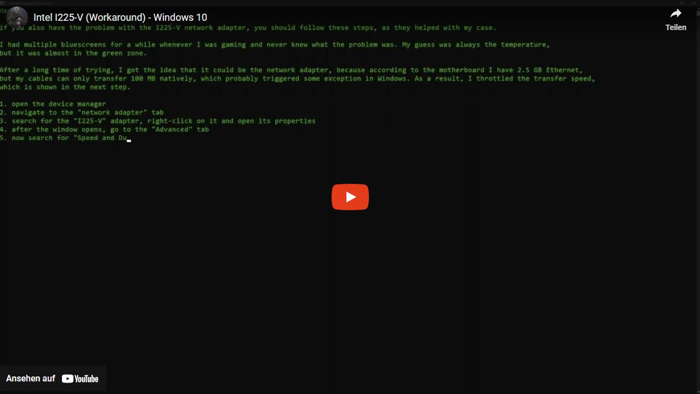

# General Description
Hello together,

I found another workaround which can help with the problem that the PC causes bluescreens through the network adapter.

Please note here that there is a risk that this workaround may not necessarily fix the problem.

# Overview about Ethernet Cables
| Category | Max Speed |
| -------- | --------- |
| CAT1     |   1 Mbps  |
| CAT2     |   4 Mbps  |
| CAT3     |  10 Mbps  |
| CAT4     |  16 Mbps  |
| CAT5     | 100 Mbps  |
| CAT5e    |   1 Gbps  |
| CAT6     |  10 Gbps  |
| CAT6a    |  10 Gbps  |
| CAT7     |  10 Gbps  |

For more information about cables https://www.firewall.cx/networking-topics/cabling-utp-fibre/112-network-cabling-utp.html

# Workaround
If you also have the problem with the I225-V network adapter, you should follow these steps, as they helped with my case.

I had multiple bluescreens for a while whenever I was gaming and never knew what the problem was. My guess was always the temperature,
but it was almost in the green zone.

After a long time of trying, I got the idea that it could be the network adapter, because according to the motherboard I have 2.5 GB Ethernet,
but my cables can only transfer 100 MB natively, which probably triggered some exception in Windows. As a result, I throttled the transfer speed,
which is shown in the next step.

1. open the device manager
2. navigate to the "network adapter" tab
3. search for the "I225-V" adapter, right-click on it and open its properties
4. after the window opens, go to the "Advanced" tab
5. now search for "Speed and Duplex" and try to set the speed of "Auto negotiation" to a fixed full duplex value

# YouTube

<iframe width="1280" height="720" src="https://www.youtube.com/embed/99vEoNPO5zk" title="Intel I225-V (Workaround) - Windows 10" frameborder="0" allow="accelerometer; autoplay; clipboard-write; encrypted-media; gyroscope; picture-in-picture" allowfullscreen></iframe>

